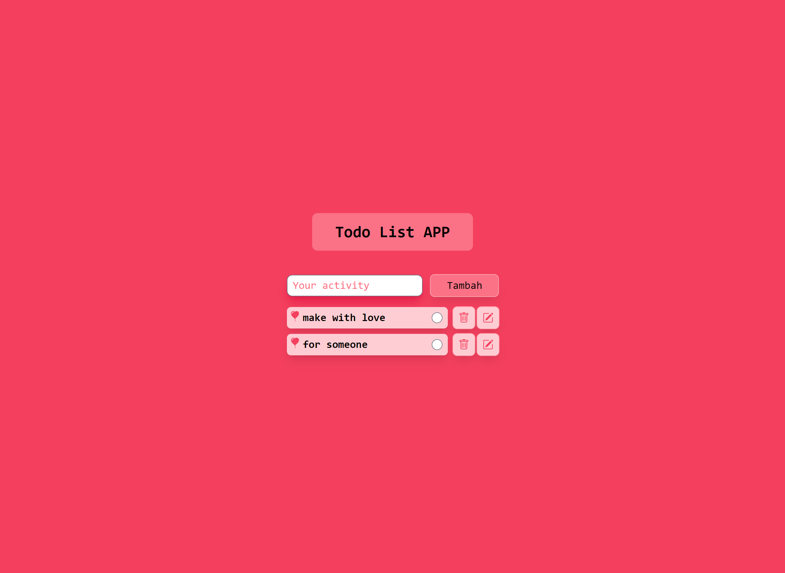

# ROSE THEME APPLICATION

## Tampilan Aplikasi

1. Tampilan depan aplikasi

   

## Teknologi yang di gunakan

- [NextJs](https://nextjs.org/)
- [Tailwindcss](https://tailwindcss.com//)
- [HeadlessUI](https://headlessui.dev/)

## Referensi

### Artikel

- [Website MDN [HTML]](https://developer.mozilla.org/en-US/docs/Web/HTML)

### Video

- [The final project (todo list app)](https://www.youtube.com/watch?v=JS5w4rUbjQE&t=12766s)
